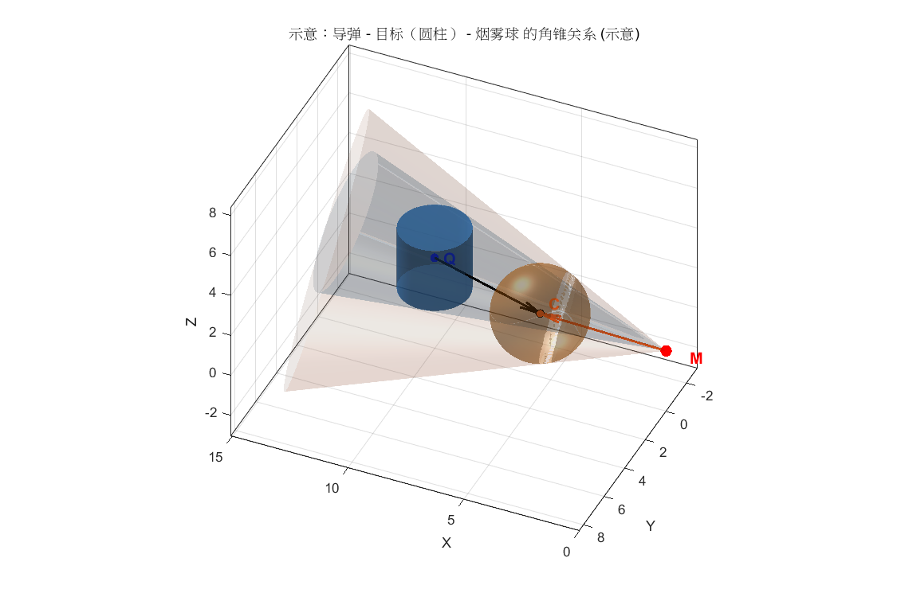
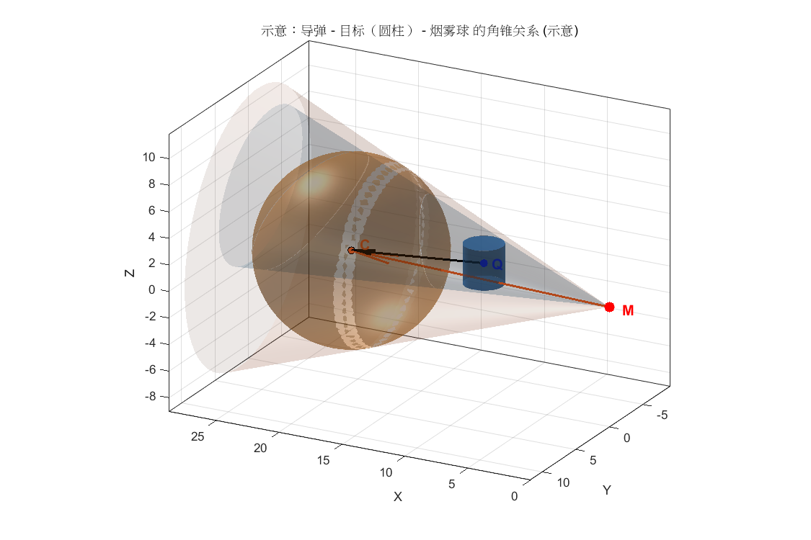

# 一、前备模型

## 1. 目标参数
- 采用三维直角坐标系，假目标位于原点，$xoy$ 平面为水平面，$z$ 轴为竖直方向。
- 真目标：半径 $r_t = 7\,\text{m}$，高 $h_t = 10\,\text{m}$ 的圆柱，下底圆心坐标为  $$P_T = (0,200,0).$$
- 假目标：半径 $r_t = 7\,\text{m}$，高 $h_t = 10\,\text{m}$ 的圆柱，下底圆心坐标为  $$O = (0,0,0).$$
## 2. 来袭导弹运动模型
- 第k个导弹初始位置 $M_k=(x_{mk},y_{mk},z_{mk})$。
- 导弹速度恒定 $v_m=300\,\text{m/s}$，飞向假目标 $O=(0,0,0)$。
- 导弹单位方向向量：
    $$\mathbf{e}_m = \frac{O-M_0}{|O-M_0|}.$$
- 速度矢量：
    $$\mathbf{V}_m=v_m*\mathbf{e}_m.$$
- 导弹运动方程：
    $$M(t) = M_0 +\mathbf{V}_m \, t \,.$$
## 3. 无人机运动模型
- 第i个无人机初始位置 $U_i=(x_{ui},y_{ui},z_{ui})$。
- 任务开始时刻 $t=0$，无人机可瞬时调整航向 $\mathbf{e}_u=(\cos\theta,\sin\theta,0)$。（ $\theta$ 为航向与$x$轴正方向的夹角）
- 无人机速度 $v_u \in [70,140]\,\text{m/s}$。
- 无人机轨迹：$$U(t) = U_0 + v_u \, t \, \mathbf{e}_u.$$

## 4. 烟幕弹运动模型
- 第k枚干扰弹投放时刻 $t_r$，释放点：
  $P_r = U(t_r).$
- 干扰弹初速度：
    $v_x = v_u \cos\theta, \quad v_y = v_u \sin\theta, \quad v_z = 0.$
- 干扰弹在释放后 $t_d$ （起爆时间）秒起爆，起爆时刻：
  $$t_e = t_r + t_d.$$
- 起爆点坐标（$P_e$）：
  $$
  \begin{aligned}
  x_e &= x_r + v_x t_d, \\
  y_e &= y_r + v_y t_d, \\
  z_e &= z_r - \tfrac{1}{2} g t_d^2.
  \end{aligned}
  $$

## 5. 烟幕云团运动模型
- 起爆瞬时形成球状云团，半径 $R_c = 10\,\text{m}$。
- 云团中心以 $v_c=3\,\text{m/s}$ 匀速下沉：
  $$
  C(t) = (x_e, y_e, z_e - v_c (t-t_e)), \quad t \geq t_e.
  $$
- 有效遮蔽时间窗口：$[t_e, t_e + T_c]$。（$有效遮蔽时间T_c=20s$）

---
# 二、考虑目标几何体积后的遮蔽判据与计算方法

## 1. 问题几何描述
- 真目标为圆柱体：
  - 圆心（底面）$T = (0, 200, 0)$.
  - 半径 $r_t = 7 m$.
  - 高度 $h_t = 10 m$.

- 从导弹视角出发考虑遮蔽：目标占据导弹的一个立体角区域 $Ω_T$，云团占据一个立体角 $Ω_C$.

## 2. 立体角定义
- **立体角**（Solid Angle）：在三维空间中，一个物体在某一点的视野中所张的角度范围。
- 对于位于点 $M$ 的观察者，一个物体 $S$ 的立体角定义为：
  $$Ω(S) = ∫∫_S (cosθ / r²) dA$$
  其中 $r$ 是 $M$ 到面元 $dA$ 的距离，$θ$ 是 $dA$ 的法向与向量 $(p-M)$ 的夹角。
- 在本问题中，我们并不需要精确积分，而是通过几何投影和角度判定进行近似或离散计算。

## 3. 云团的立体角
- 云团为一个球体，中心 $C$，半径 $R_c$。
- 从导弹位置 $M$ 看去，云团的投影在单位球面上是一个圆帽$（spherical cap）$.
- 定义：
  - 向量 $u_c = (C - M) / |C - M| $ —— 云团中心的单位方向
  - 半顶角 $θ_c = arcsin(R_c / |C - M|)$
- 云团覆盖区域：
  $$Ω_C = { u ∈ S² : arccos(u·u_c) ≤ θ_c }$$
- 云团对应立体角的大小（数值参考，不用于判定）：
  $|Ω_C| = 2π (1 - cos θ_c)$
  
## 4. 目标圆柱的立体角
- 目标圆柱表面参数化：
  - 底圆心 $T=(0,200,0)$，半径 $r_t$，高度 $h_t$
  - 点集 $$p(φ,z) = T + (r_t cosφ, r_t sinφ, z), φ ∈ [0,2π], z ∈ [0,h_t]$$
- 从导弹 $M$ 看去，目标表面每个点对应单位方向：
  $$u_p = (p - M) / |p - M|$$
- 整个目标投影区域：
  $$Ω_T = { u_p | p ∈ 圆柱表面 }$$

## 5. 圆柱体的离散化
- 采样目标点：  
  - $φ\in[0,2π)$，划分 $N_φ$ 份  
  - $z\in[0,h_t]$，划分 $N_z$ 份  

## 6. 遮蔽判定

- 对每个目标点 $p$，计算单位向量 $u_p$  
- 计算与云团方向的夹角：
    $ α_p = arccos(u_p · u_c) $  
- 若 $∀p: α_p ≤ θ_c$，则目标在该时刻完全被云团覆盖：  
$$ Ω_T ⊆ Ω_C$$
- 根据如下示意图可以看出：$ MC \cdot QC < 0$时烟雾云团位于导弹与目标之间；$ MC \cdot QC > 0$时目标位于导弹与烟雾云团之间。所以遮蔽判据有空间约束：$$ MC \cdot QC < 0 $$

- 根据题意遮蔽判据有时间约束：$$t_{e}=t_{r}+t_{d}\le t_{\text{hit}}$$

# 三、单个无人机投放单个烟幕弹干扰一个导弹的模型
- 定义遮蔽指示函数：
$$
\mathbb{G}(t)=
\begin{cases}
1, & \text{若云团 $i$ 在时刻 $t$ 遮蔽导弹}\\
0, & \text{else}
\end{cases}
$$
- 总遮蔽时间为：
$$
J=\int_{t_e}^{t_{\text{hit}}} \mathbb{G}(t)dt.
$$
其中 $t_{\text{hit}}$ 为导弹击中假目标所需时间。

- 决策变量： 
    - 无人机速度 $v$ 与航向 $\theta$  
    - 投放时刻 $t_{r}$ 与起爆时间 $t_{d}$

- 优化问题：
$$
\begin{aligned}
\max_{v_u,\theta,t_r,t_d} \; J \\
\text{s.t.}\quad 
& v_{\min}\le v \le v_{\max} \\
& t_{r}\ge0,\; t_{d}>0,\; t_{e}=t_{r}+t_{d}\le t_{\text{hit}} \\
\end{aligned}
$$

# 四、单个无人机投放多个烟幕弹干扰一个导弹的模型

- 烟幕干扰弹（第 $k$ 枚，$k=1,2,3$）
  - 释放时刻：$t_{r,k}$  
  - 延迟起爆：$t_{d,k}$  
  - 起爆时刻：$t_{e,k}=t_{r,k}+t_{d,k}$  
  - 起爆点：  
    $$
    \mathbf{P}_k=\mathbf{U}(t_{r,k}) + v\mathbf{h}t_{d,k} - \tfrac{1}{2}g t_{d,k}^2 \mathbf{e}_z
    $$
  - 云团半径：$R_c=10\,\text{m}$  
  - 下沉速度：$w=3\,\text{m/s}$  
  - 持续时间：$T_c=20\,\text{s}$  
  - 云团中心运动：  
    $$
    \mathbf{C}_k(t)=\mathbf{P}_k - w(t-t_{e,k})\mathbf{e}_z, 
    \quad t\in[t_{e,k},t_{e,k}+T_c]
    $$

- 定义遮蔽指示函数：
$$
\mathbb{G}_k(t)=
\begin{cases}
1, & \text{若云团 $k$ 在时刻 $t$ 遮蔽导弹}\\
0, & \text{否则}
\end{cases}
$$

- 总遮蔽时间（并集时长）为：$$J=\int_{0}^{t_{\text{hit}}} 
\mathbf{1}\!\left(\sum_{k=1}^3 \mathbb{G}_k(t)\ge 1\right) dt$$
其中 $t_{\text{hit}}$ 为导弹击中假目标所需时间。

- 决策变量：
  - 无人机速度 $v$ 与航向 $\theta$  
  - 每枚弹的释放时刻 $t_{r,k}$ 与延迟 $t_{d,k}$

- 优化问题：
$$
\begin{aligned}
\max_{v,\theta,t_{r,k},t_{d,k}} \quad & J \\
\text{s.t.}\quad 
& v_{\min}\le v \le v_{\max} \\
& t_{r,k}\ge0,\; t_{d,k}>0,\; t_{e,k}=t_{r,k}+t_{d,k}\le t_{\text{hit}} \\
& |t_{r,i}-t_{r,j}|\ge1,\;\forall i\neq j
\end{aligned}
$$

# 五、多个无人机投放多个烟幕弹干扰一个导弹的模型

- 第$i$架无人机的烟幕干扰弹（第 $i$ 架，$i=1,2,3$）
  - 释放时刻：$t_{r,i}$  
  - 延迟起爆：$t_{d,i}$  
  - 起爆时刻：$t_{e,i}=t_{r,i}+t_{d,i}$  
  - 起爆点：  
    $$
    \mathbf{P}_i=\mathbf{U}(t_{r,i}) + v\mathbf{h}t_{d,i} - \tfrac{1}{2}g t_{d,i}^2 \mathbf{e}_z
    $$
  - 云团半径：$R_c=10\,\text{m}$  
  - 下沉速度：$w=3\,\text{m/s}$  
  - 持续时间：$T_c=20\,\text{s}$  
  - 云团中心运动：  
    $$
    \mathbf{C}_i(t)=\mathbf{P}_i - w(t-t_{e,i})\mathbf{e}_z, 
    \quad t\in[t_{e,i},t_{e,i}+T_c]
    $$

- 定义遮蔽指示函数：
$$
\mathbb{G}_i(t)=
\begin{cases}
1, & \text{若云团 $i$ 在时刻 $t$ 遮蔽导弹}\\
0, & \text{否则}
\end{cases}
$$

- 总遮蔽时间（并集时长）为：$$J=\int_{0}^{t_{\text{hit}}} 
\mathbf{1}\!\left(\sum_{k=1}^3 \mathbb{G}_i(t)\ge 1\right) dt$$
其中 $t_{\text{hit}}$ 为导弹击中假目标所需时间。

- 决策变量：
  - 无人机速度 $v$ 与航向 $\theta$  
  - 每枚弹的释放时刻 $t_{r,i}$ 与延迟 $t_{d,i}$

- 优化问题：
$$
\begin{aligned}
\max_{v,\theta,t_{r,i},t_{d,i}} \quad & J \\
\text{s.t.}\quad 
& v_{\min}\le v \le v_{\max} \\
& t_{r,i}\ge0,\; t_{d,i}>0,\; t_{e,i}=t_{r,i}+t_{d,i}\le t_{\text{hit}} \\
\end{aligned}
$$

# 六、无人机干扰导弹的优势评估模型
## 1. 最小包容球面帽
- 对导弹位置 $M$，投影目标表面点：
$$
u_k = \frac{p_k - M}{\|p_k - M\|}, \quad k=1,\dots,N
$$
- 求解最小球面帽问题：
$$
\psi_T = \min_{u \in \mathbb{S}^2} \; \max_k \arccos(u \cdot u_k)
$$
- 等价凸优化形式：
$$
\begin{aligned}
\max_{u, t} \quad & t \\
\text{s.t.} \quad & u^\top u_k \ge t, \quad k=1,\dots,N \\
& \|u\|_2 \le 1
\end{aligned}
$$
- 解得最优方向 $u_T^*$，半角 $\psi_T = \arccos(t^*)$。
---
## 2. 云团球心可行域条件
- 记 $r = \|C-M\|$，方向 $s = \frac{C-M}{\|C-M\|}$，球体半顶角为：
$$
\theta_C(r) = \arcsin\!\left(\frac{R_c}{r}\right)
$$
- 定义烟雾利用率
$$
\eta = \min\left(1,\; \frac{\psi_T}{\theta_C(r)}\right)
$$
- 令$s=u_T^*$，满足遮蔽条件下，$ \eta \in [0.80,1] $，等$\eta$步长采样。
---
## 3. 无人机飞行及烟幕弹投放时间
- 对于无人机飞行以及烟幕弹投放和起爆整个过程中，显然云团的匀速下沉对于云团球心的影响是微乎其微的。于是我们可以只考虑无人机的匀速直线运动以及烟幕弹的平抛运动。
- 无人机与球心的水平距离$d_h=\sqrt{(x_{fy}-x_c)^2+(y_{fy}-y_c)^2}$，垂直距离$d_v=|z_{fy}-z_c|$，于是平抛运动$t_p=\sqrt{2d_v/g}$，匀速直线运动$t_l=d_h/v-t_p$.
- 定义时间函数$$T_{min}(C)=(t_p+t_l)_{min}=(t_p+t_l)|_{v=v_{max}}.$$$$T_{max}(C)=(t_p+t_l)_{max}+T_c=(t_p+t_l)|_{v=v_{min}}+T_c.$$
---
## 4. 罚函数

- 两种越界情形：晚到 $\Delta_\text{late}=T_{min}-t>0$ 与 早到$\Delta_\text{early}=t-T_{max}>0$。
-  需要满足：在 $\Delta\le0$ 时惩罚为 0；当 $\Delta>0$ 时 **立即**给出较强惩罚（初始斜率大），但随着 $\Delta$ 增大，惩罚 **增速下降并最终饱和**（不再线性增长）。
- 定义 $\Delta = T(C)-t$。归一化尺度 $\tau$ 取任务典型时间，并设参数 $k$ (softness)、权重 $\lambda$。
- 罚函数：
$$
P(T_{min}(C)，T_{max}(C),t)= \left( \frac{1}{\tau}\cdot \frac{1}{k}\ln\big(1+\exp(k\,\Delta_\text{late})\big) \right)^{2} +\left( \frac{1}{\tau}\cdot \frac{1}{k}\ln\big(1+\exp(k\,\Delta_\text{early})\big) \right)^{2};
$$
该函数连续、可导，适合数值优化，也便于解释与调参。
- 调参：
  - 选择时间尺度 $\tau$ 为导弹击中假目标的用时。
  - 选择 $k$：平滑参数，典型 $k=5$（较陡）或 $k=2$（更平滑）。
---
## 5. 评估函数 
$$
\mathbb{E}(C,\eta,t) =\int_{0}^{t_{\text{hit}}} 
\!\int_{0}^{1} 
\!T_{min}^{-1}(C)(1+\gamma \eta) - \lambda P(T_{min}(C)，T_{max}(C),t)d\eta dt
$$

## 6. 根据评分分配无人机
按照评分排名给出多套合理、科学的分配方案，将不同的无人机分配去干扰不同的导弹

# 七、多个无人机投放多个烟幕弹干扰多个导弹的模型

- 根据评估模型构建决策矩阵$X_{i,j,k}$，其中$x_{i,j,k}=1$表示第$i$架无人机干扰$j$枚导弹的第$k$个烟雾弹。
- 第$i$架无人机的第$k$个烟雾弹（$i=1,2,3$ , $k=1,2,3$）
  - 释放时刻：$t_{r,i,k}$  
  - 延迟起爆：$t_{d,i,k}$  
  - 起爆时刻：$t_{e,i,k}=t_{r,i,k}+t_{d,i,k}$  
  - 起爆点：  
    $$
    \mathbf{P}_{i,k}=\mathbf{U}(t_{r,i,k}) + v\mathbf{h}t_{d,i,k} - \tfrac{1}{2}g t_{d,i,k}^2 \mathbf{e}_z
    $$
  - 云团半径：$R_c=10\,\text{m}$  
  - 下沉速度：$w=3\,\text{m/s}$  
  - 持续时间：$T_c=20\,\text{s}$  
  - 云团中心运动：  
    $$
    \mathbf{C}_{i,k}(t)=\mathbf{P}_{i,k} - w(t-t_{e,i,k})\mathbf{e}_z, 
    \quad t\in[t_{e,i},t_{e,i}+T_c]
    $$

- 定义遮蔽指示函数：
$$
\mathbb{G}_{i,k}(t)=
\begin{cases}
1, & \text{若第$i$架无人机的第$k$个云团 $k$ 在时刻 $t$ 遮蔽导弹}\\
0, & \text{else}
\end{cases}
$$

- 总遮蔽时间（并集时长）为：
$$
J=\sum_{i=1}^3\int_{0}^{t_{\text{hit}}} 
\mathbf{1}\!\left(\sum_{k=1}^3 \mathbb{G}_{i,k}(t)\ge 1\right) dt
$$
其中 $t_{\text{hit}}$ 为导弹击中假目标所需时间。

- 决策变量：
  - 无人机速度 $v_i$ 与航向 $\theta_i$  
  - 每枚弹的释放时刻 $t_{r,i,k}$ 与延迟 $t_{d,i,k}$

- 优化问题：
$$
\begin{aligned}
\max_{v,\theta,t_{r,i,k},t_{d,i,k}} \quad & J \\
\text{s.t.}\quad 
& v_{\min}\le v_i \le v_{\max} \\
& t_{r,i,k}\ge0,\; t_{d,i,k}>0,\; t_{e,i},k=t_{r,i,k}+t_{d,i,k}\le t_{\text{hit}} \\
& |t_{r,i,p}-t_{r,i,q}|\ge1,\;\forall p \neq q
\end{aligned}
$$
